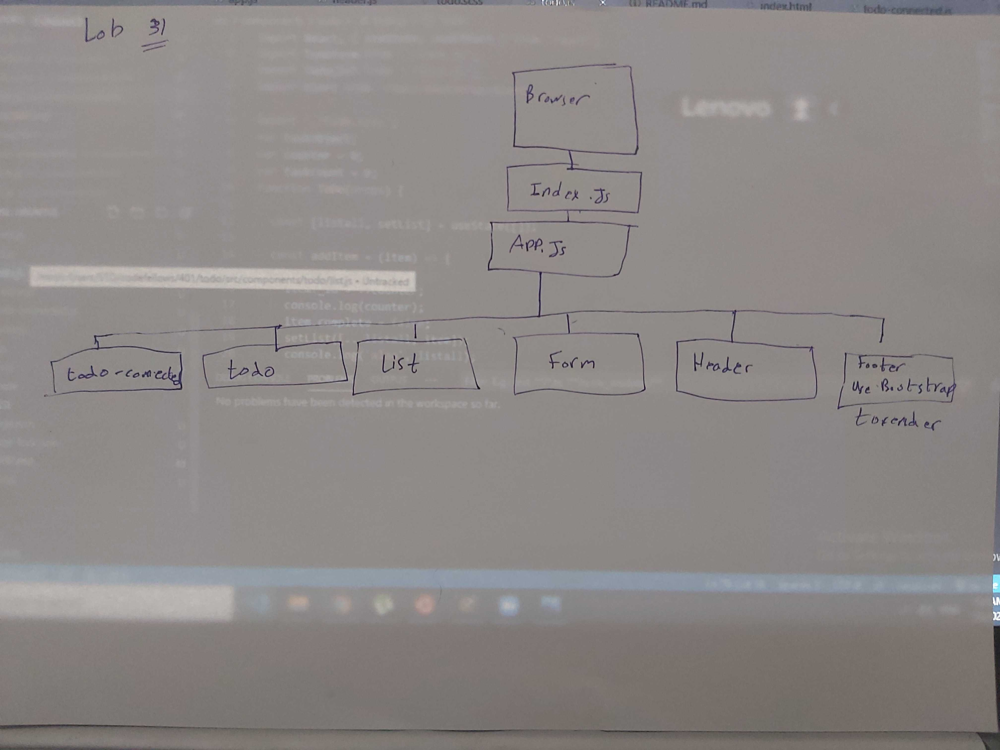

# LAB - 31
<!-- ## Project: Project Name Here -->
## Hooks API

### Author: Abdallah Obaid

### Links and Resources

* [submission PR](https://github.com/Abdallah-Obaid/todo/pull/1)
<!-- * [travis](https://github.com/Abdallah-401-advanced-javascript/caps/pull/2/checks?check_run_id=775094621)ز -->
<!-- * [ci/cd](https://github.com/Abdallah-401-advanced-javascript/caps/pull/2/checks?check_run_id=775094661) -->
<!-- - [back-end server url](http://xyz.com) (when applicable) -->
<!-- * [front-end application](https://abdallah-lab-00.herokuapp.com/)  -->
### Deployment:
* [GitHub Page](https://abdallah-obaid.github.io/todo/)
<!-- * [Netlify](https://stoic-jennings-e5b7bc.netlify.app/) -->

### Documentation
<!-- * [jsdoc](https://abdallah-lab-00.herokuapp.com/docs/) -->
<!-- * [swagger](https://app.swaggerhub.com/apis/AbdallahObaid/class-06/0.1)  -->

### Modules
<!-- #### `events.js`. -->

##### Exported Values and Methods
`<form/>` function, `<Footer/>` function,`<Header/>` function,`<todo/>` function, `<list/>` function, `<todo-connected/>` function
<!-- ###### `events.js`
This is to require the event and use it in the other files. -->

### Setup

#### `.env` requirements 
SKIP_PREFLIGHT_CHECK=true
<!-- PORT=3030 // not used yet
storeName=AbuAlFalafel -->

#### How to initialize/run your application 

* `npm init -y`

## Available Scripts

#### `npm test`

Launches the test runner in the interactive watch mode. 
See the section about [running tests](https://facebook.github.io/create-react-app/docs/running-tests) for more information.

#### `npm run build`

Builds the app for production to the `build` folder. 
It correctly bundles React in production mode and optimizes the build for the best performance.

The build is minified and the filenames include the hashes. 
Your app is ready to be deployed!

See the section about [deployment](https://facebook.github.io/create-react-app/docs/deployment) for more information.

#### `npm run eject`

**Note: this is a one-way operation. Once you `eject`, you can’t go back!**

If you aren’t satisfied with the build tool and configuration choices, you can `eject` at any time. This command will remove the single build dependency from your project.

Instead, it will copy all the configuration files and the transitive dependencies (webpack, Babel, ESLint, etc) right into your project so you have full control over them. All of the commands except `eject` will still work, but they will point to the copied scripts so you can tweak them. At this point you’re on your own.

You don’t have to ever use `eject`. The curated feature set is suitable for small and middle deployments, and you shouldn’t feel obligated to use this feature. However we understand that this tool wouldn’t be useful if you couldn’t customize it when you are ready for it.
<!-- *  Use git,postman or sawgger to use crud methods. -->

#### How to use your library (where applicable)
<!-- * use const lib=require('lib') -->
<!-- const basic = require('../events'); -->

#### Tests

* Shallow, Mount and Snapshot tests: `npm test`
* Lint Tests: `npm run lint`

<!-- Incomplete Tests: -->

#### UML

